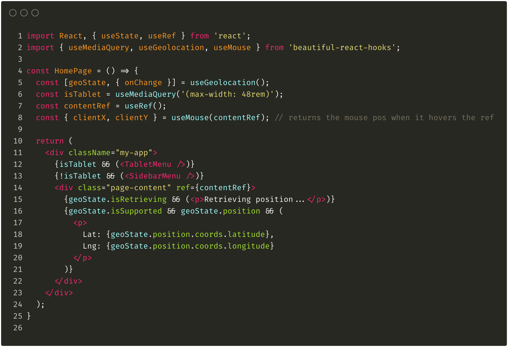

Коллекция красивых (и, надеюсь, полезных) хитов React для ускорения разработки ваших компонентов и хуков

<div>
  <p align="center">
    <a href="https://beautifulinteractions.github.io/beautiful-react-hooks/" target="_blank">
    🌟 Попробуй их в действии тут 🌟
    </a>
  </p>
</div>



## 💡 Зачем?

Пользовательские React-хуки позволяют абстрагировать бизнес-логику компонентов в отдельные функции многократного использования. <br />
До сих пор мы обнаружили, что большинство хуков, которые мы создали и поэтому разделяли между нашими внутренними проектами, довольно часто
аналогичны по сути, которая включает в себя ссылки на обратный вызов, события и жизненный цикл компонентов. <br />
По этой причине мы постарались обобщить эту суть в `"beautiful-react-hooks"`: набор (_надеюсь_) полезных хуков, чтобы помочь другим компаниям и специалистам ускорить процесс разработки. <br /> <br />
Кроме того, мы создали лаконичный, но конкретный API, с точки зрения читабельности кода, с целью держать кривую изучения столь низкой, насколько это возможно, поэтому это может быть использовано и распространено в больших командах.

**-Пожалуйста, перед использованием любого хука, прочитайте его документацию!-**

## ☕️ Характеристики

- Краткий API
- Маленький размер и легкость
- Легко учить
- Функциональный подход
- Полностью написан на JS (хотя поддерживаются типы TS)

<div>
  <p align="center">
    <a href="https://beautifulinteractions.github.io/beautiful-react-hooks/" target="_blank">
    🌟 Попробуй их в действии тут 🌟
    </a>
  </p>
</div>

## 🕺 Установка

Используя `npm`:

```bash
$ npm install beautiful-react-hooks
```

Используя `yarn`:

```bash
$ yarn add beautiful-react-hooks
```

## 🎨 Hooks

- [useGlobalEvent](docs/useGlobalEvent.md)
- [usePreviousValue](docs/usePreviousValue.md)
- [useValueHistory](docs/useValueHistory.md)
- [useValidatedState](docs/useValidatedState.md)
- [useMediaQuery](docs/useMediaQuery.md)
- [useOnlineState](docs/useOnlineState.md)
- [useViewportSpy](docs/useViewportSpy.md)
- [useGeolocation](docs/useGeolocation.md), [useGeolocationState](docs/useGeolocationState.md) and [useGeolocationEvents](docs/useGeolocationEvents.md)
- [useDrag](docs/useDrag.md), [useDragEvents](docs/useDragEvents.md)
- [useMouse](docs/useMouse.md), [useMouseState](docs/useMouseState.md) and [useMouseEvents](docs/useMouseEvents.md)
- [useLifecycle](docs/useLifecycle.md), [useDidMount](docs/useDidMount.md) and [useWillUnmount](docs/useWillUnmount.md)
- [useWindowResize](docs/useWindowResize.md)
- [useWindowScroll](docs/useWindowScroll.md)
- [useRequestAnimationFrame](docs/useRequestAnimationFrame.md)
- [useTimeout](docs/useTimeout.md)
- [useConditionalTimeout](docs/useConditionalTimeout.md)
- [useInterval](docs/useInterval.md)
- [useDebouncedFn](docs/useDebouncedFn.md)
- [useThrottledFn](docs/useThrottledFn.md)
- [useLocalStorage](docs/useLocalStorage.md)

## Вклад.

Вклад очень приветствуется и нужен.

Чтобы отправить свой пользовательский хук, пожалуйста, убедитесь, что вы прочитали наши рекомендации [CONTRIBUTING] (./ CONTRIBUTING.md).

**Перед отправкой** нового запроса на слияние (merge реквест), пожалуйста, убедитесь:

1. Вы обновили версию `package.json` и сообщили о своих изменениях в файл [CHANGELOG] (./ CHANGELOG.md).
2. убедитесь, что вы запускаете `npm test` и `npm build` перед отправкой запроса на слияние (merge реквест).
3. убедитесь, что вы добавили документацию для своего пользовательского хука (_вы можете использовать [HOOK_DOCUMENTATION_TEMPLATE] (./ HOOK_DOCUMENTATION_TEMPLATE.md) для документирования своего пользовательского хука_).
4. убедитесь, что вы обновили файл `index.d.ts` с вашими типами хуков.

### При содействии:

- [React](https://reactjs.org/)
- [Mocha](https://mochajs.org/)
- [Chai](https://www.chaijs.com/)
- [@testing-library/react](https://testing-library.com/docs/react-testing-library/intro)
- [@testing-library/react-hooks](https://react-hooks-testing-library.com/)
