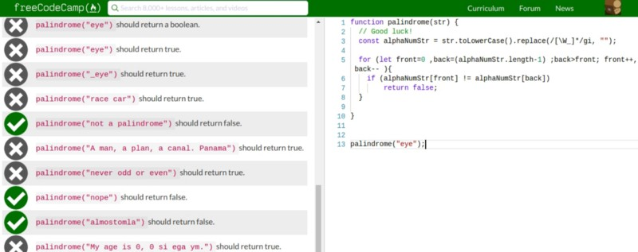
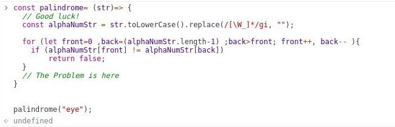
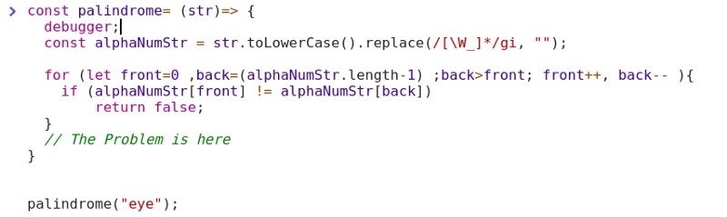
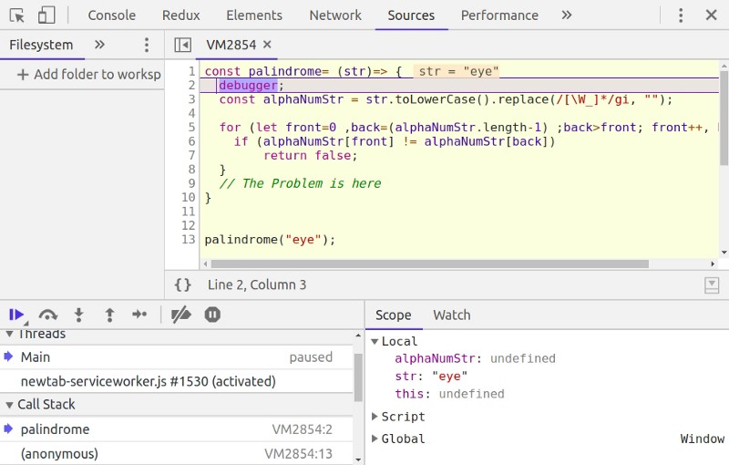
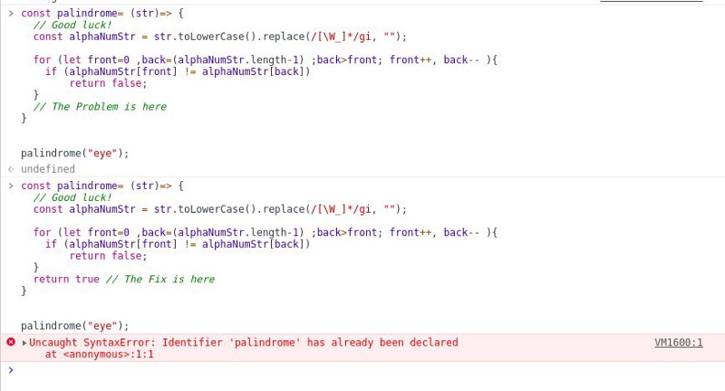
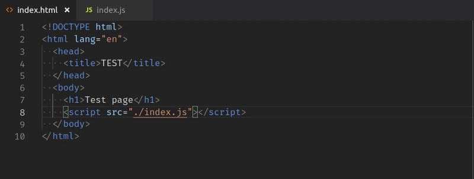
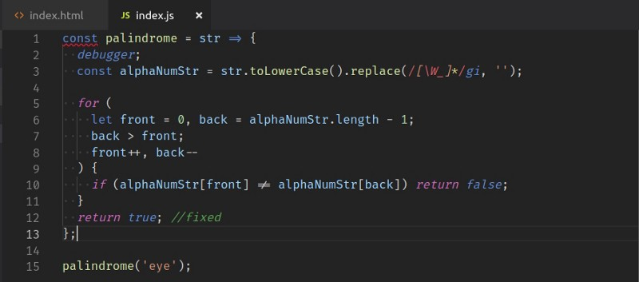
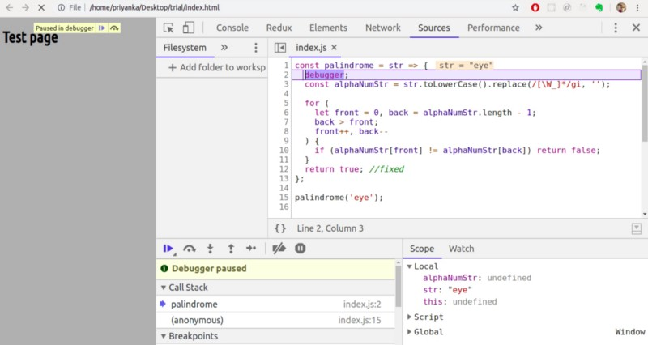

#  Советы и рекомендации по отладке для начинающих JavaScript #

Моя аудитория для этого урока - начинающие программисты. Вы узнаете об отладке без разочарований с помощью инструментов разработчика Chrome. 

Дорогой новичок, недавно я был там, где ты есть! После многих трудностей я чувствую, что далеко продвинулась в своем учебном путешествии. В настоящее время я нахожусь на старшей стадии иммерсивного буткемпа, где я создаю приложения с полным стеком. 

Каждый день я учусь и сталкиваюсь со многими вещами, которые я хотел знать раньше. Эта статья - попытка поделиться одной такой идеей, которая облегчит вашу жизнь. 

Как вы, наверное, поняли, лучший способ научиться программированию - это делать. Теперь, когда вы начинаете практиковать кодирование, иногда (или в большинстве случаев) ваш код не будет работать; другими словами, в вашем коде будет ошибка. И вы, возможно, уже попробовали и узнали некоторые подходы к отладке. Эта статья не о каком-либо одном подходе к отладке, а скорее о настройке для отладки вашего кода для практики программирования. 

Если вы практикуете в среде онлайн-разработки, скорее всего, у вас есть установка, где у вас есть редактор, проблема и набор тестов, который тестирует вашу программу. 

Вы написали код, и есть некоторые ошибки, и в какой-то момент ошибки, выдаваемые набором тестов, не очень помогают. 

Я не буду подробно останавливаться на том, насколько утомительной отладкой здесь может стать, - позвольте мне сразу перейти к некоторым советам для начинающих. 

## Проблема ##
В качестве примера я пишу палиндромную проверку в редакторе FreeCodeCamp. Мое решение не удается. В этом случае мы могли бы использовать результаты тестового набора для отладки. 

Но давайте предположим, что этот набор тестов не дает мне точных указаний на точную ошибку. (Это может быть не идеальный пример с точки зрения логической ошибки. Дело в том, что вы столкнетесь с проблемами, когда набор тестов не будет напрямую указывать на логическую ошибку.) 

### Совет: используйте консоль инструментов разработчика. ###

Я запускаю тот же код в консоли с ошибочным тестовым примером и вижу, что он возвращает `undefined`. Это означает, что код не вернул никакого значения. Я быстро вижу, что забыл вернуть `true`, если было обнаружено, что строка является палиндромом. 

Это была очень простая ошибка. В большинстве случаев у вас бывают ошибки, которые нужны вам для проверки ваших переменных. Один из подходов к проверке переменных - это ***console.log (<переменные>)*** в программе. 

Однако я бы посоветовал вам использовать отладчик ***dev tools debugger***. В своей программе вы можете указать точку, с которой вы хотите начать получать помощь от отладчика. 

Отладчик покажет вам все переменные в стеке вызовов и позволит вам выполнять вызовы функций, которые вы найдете очень полезными. 

Вы освоите использование отладчика, как только используете его несколько раз. Обратите внимание на стрелки в левом нижнем поле? Это позволит вам контролировать ход программы и показывать переменные по мере их изменения. 

Теперь давайте начнем трюк. 

### Трюк: Сделайте свой setup ###

Как видно выше, с помощью отладчика и консоли мы можем легко выявить проблемы. Однако, если я хочу снова запустить исправленную программу на консоли с одной лишь строкой изменения, мне придется повторно ввести ее. 

Даже после этого я получаю ошибку: 

Эта ошибка вызвана тем, что я использовал стрелочную функцию и не могу повторно объявить `const`. Это означает, что мне придется открывать новую вкладку и новую консоль каждый раз, когда я изменяю свой код. Дополнительные накладные расходы, верно? 

Давайте найдем обходной путь. В вашей системе создайте каталог и перейдите в этот каталог. 

Теперь создайте два файла: `index.js` и `index.html`. Введите следующий HTML-код в `index.html`: 

Теперь переместите ваш код из консоли в `index.js`. Обратите внимание, что я запустил отладчик в строке 2 в коде. 

Теперь запустите файл `index.html` в браузере. Откройте инструменты разработчика или консоль (возможно, вам придется обновить, чтобы увидеть отладчик). Вы можете отладить свой код здесь. 

Теперь каждый раз, когда вы вносите изменения в `index.js`, вы просто нажимаете кнопку Обновить на этой вкладке, и код перезапускается. Не нужно закрывать и открывать вкладки, не перепечатывать целые программы. 

Держите папку, которую вы только что создали, под рукой. Всякий раз, когда вам нужно попробовать или отладить кусок кода, вставьте его в `index.js` и поэкспериментируйте !! 

### Заключительные мысли ###
Если вы уже знали это, поздравляю, вы потратили драгоценные 4 минуты;)

Наконец, помните, _не ошибается то, кто ничего не делает_! Не беспокойтесь об ошибках - они научат вас самым ценным урокам программирования ... _а потом ... О! места, куда вы пойдете_ ...

Автор статьи [Priyanka Garg](https://medium.freecodecamp.org/debugging-javascript-for-beginners-5d4ac15dd1cd?fbclid=IwAR1CoMp07PD8dpo8KnX-9nX_6C9XpZ1xJQUU-n2doscgsAsKP32QjpeDkuY) Оригинал статьи доступен по ссылке.  Автор перевода [Yaroslav Kolesnikov](https://github.com/YaroslavW)