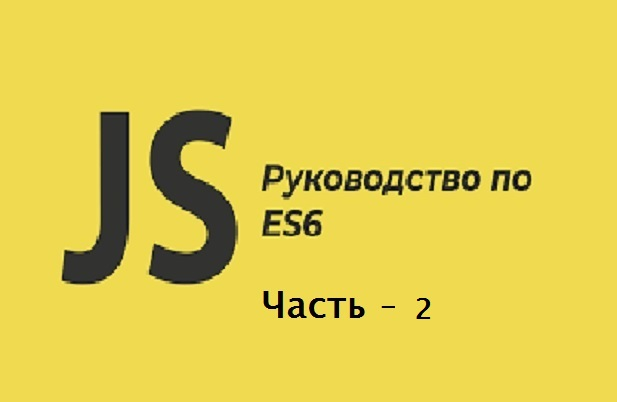

# Знаете ли вы ES6 - часть 2.

[Знаете ли вы ES6 - часть 1.](https://github.com/YaroslavW/trening-js/blob/master/Texts/ES6/es6-part1.md)

[Знаете ли вы ES6 - часть 2.](https://github.com/YaroslavW/trening-js/blob/master/Texts/ES6/es6-part2.md)

[Знаете ли вы ES6 - часть 3.](https://github.com/YaroslavW/trening-js/blob/master/Texts/ES6/es6-part3.md)

<hr>



Прежде чем вы начнете читать эту часть, мы обсудили некоторые функции ES6 [здесь](https://github.com/YaroslavW/trening-js/blob/master/Texts/ES6/es6-part1.md)

Как мы уже говорили, ES6 - это JS.

ES6 следующее поколение Javascript. В общем, ES6 позволяет нам писать чистые и надежные react-приложения, и это помогает нам делать более мощные вещи.

Содержание:

- Array functions - Функции массива
- Template literals - Шаблонные литералы
- Object literals - Объектные литералы
- For Of

## Array functions - Функции массива.

Есть много функций, которые мы можем выполнять с массивом, таких как `map`, `concat`, `join`, `splice`, и таких методов много. Все эти методы не ES6, а обычные JS.

`map` - это встроенный метод массива, который возвращает реальный новый массив.

```javascript
const numbers = [1, 2, 3];
const doubleNumbers = numbers.map(num => {
  return num * 2;
});

console.log(numbers); //[1, 2, 3]
console.log(doubleNumbers); //[2, 4, 6]
```

`concat` - это метод, который объединяет два или более массивов и возвращает новый массив со значениями объединенных массивов.

```javascript
const myName = ["Yaroslav", "Kolesnikov"];
const myInfo1 = ["Computer", "Science", "Student"];
const myInfo2 = ["Front End Developer"];

const concatTwoArray = (arr1, arr2, arr3) => arr1.concat(arr2, arr3);

console.log(concatTwoArray(myName, myInfo1, myInfo2));
// ["Yaroslav", "Kolesnikov", "Computer", "Science", "Student", "Front End Developer"]
```

`join` - это метод, который объединяет элементы массива в строку и возвращает окончательную строку.
Окончательная строка будет разделена указанным разделителем, таким как разделитель по умолчанию, который является запятой (`,`), bar (`|`), тире (`-`), пробел или любой другой разделитель.

```javascript
let fruits = ["Yaroslav", "Kolesnikov", "Yousef", "YaroslavW", "gitHub"];
let energy1 = fruits.join();
let energy2 = fruits.join(" ");
let energy3 = fruits.join("|");
let energy4 = fruits.join(" and ");
console.log(energy1, energy2, energy3, energy4);
// Yaroslav,Kolesnikov,Yousef,YaroslavW,gitHub Yaroslav Kolesnikov Yousef YaroslavW gitHub Yaroslav|Kolesnikov|Yousef|YaroslavW|gitHub Yaroslav and Kolesnikov and Yousef and YaroslavW and gitHub
```

`splice` метод - это добавление элементов в массив, удаление элементов из массива и возврат последнего элемента.

В следующем примере мы удаляем один элемент из индекса 2 (третий элемент). Затем мы удаляем 3 элемента из индекса и добавляем 2 элемента [Computer and Science]

```javascript
let names = ["Yaroslav", "Kolesnikov", "Yousef", "Yaroslav", "gitHub"];
names.splice(2, 1);
console.log(names);
// ["Yaroslav", "Kolesnikov", "Yaroslav", "gitHub"]

names.splice(2, 3, "Computer", "Science");
console.log(names);
//["Yaroslav", "Kolesnikov", "Computer", "Science"]
```

[Узнать больше](https://developer.mozilla.org/en-US/docs/Web/JavaScript/Reference/Global_Objects/Array# "developer.mozilla.org")

## Template literals - Шаблонные литералы.

Прежде чем мы определим, что такое литералы шаблона, давайте вспомним, что в обычном JS для объединения строк это было сделано с помощью оператора конкатенации строк (`+`). Также вы можете использовать метод `concat ()` строки.

```javascript
const my_name = "Yaroslav";
const message0 = "My name is " + my_name;
console.log(message0);
// My name is Yaroslav
```

На самом деле не рекомендуется использовать оператор `+` для объединения строк, потому что он становится более сложным, когда вам нужно создавать многострочные строки.

```javascript
const fstName1 = "Yaroslav",
  lastName1 = "Kolesnikov";
const message1 =
  "My name is " + fstName1 + ".\n\n" + "My last name is " + lastName1;
console.log(message1);
// My name is Yaroslav.
//
// My last name is Kolesnikov
```

Таким образом, литералы шаблона решают проблему многострочных строк.

Шаблонные литералы - это строковые литералы, которые включают в себя встроенные выражения.
Обозначается с помощью backticks ( _``_) вместо одинарных кавычек (`''`) или двойных кавычек (`""`). Шаблонные литералы могут содержать заполнители, которые представлены с помощью `$ {expression}`. Это значительно упрощает построение строк.

Используя литералы шаблона, вы можете удалить кавычки вместе с оператором конкатенации строк. В общем, Template Literals используется для более простой интерполяции строк.

```javascript
const my_Name = "Yaroslav";
const message1 = `My name is ${my_Name}`;
console.log(message1);
// My name is Yaroslav
```

Также вы можете ссылаться на свойства объекта внутри выражений.

```javascript
const myName = {
  name: "Yaroslav",
  age: 48
};

const myFather = {
  name: "Kolesnikov"
};

let message2 =
  "My name is " +
  myName.name +
  ". I am " +
  myName.age +
  " years old" +
  " and my father name is " +
  myFather.name;
console.log(message2);
// My name is Yaroslav. I am 48 years old and my father name is Kolesnikov
let message3 = `My name is ${myName.name}. I am ${
  myName.age
} years old and my father name is ${myFather.name}`;
console.log(message3);
// My name is Yaroslav. I am 48 years old and my father name is Kolesnikov
```

Как насчет многострочного примера?

```javascript
const fstName = "Yaroslav",
  lastName = "Kolesnikov";
const message0 = `My name is ${fstName}, 

My last name is ${lastName}`;
console.log(message0);
// My name is Yaroslav,
//
// My last name is Kolesnikov
```

##### Destructuring Arrays and Template Literals

Деструктуризация и шаблонные литералы.
Круто, я думаю, вы помните деструктуризацию массива из [первой части](https://github.com/YaroslavW/trening-js/blob/master/Texts/ES6/es6-part1.md).
Здесь я печатаю свое имя в одну строку и многострочно.

```javascript
const names = [
  "Adrian",
  "Yaroslav",
  "Jain",
  "Sarah",
  "Kolesnikov",
  "John",
  "Adel",
  "Yousef"
];

const [, First, , , Second, , , Third] = names;

let myName = `My name is ${First} ${Second} ${Third}`;
console.log(myName);
// My name is Yaroslav Kolesnikov Yousef
myName = `My name is
1. ${First}
2. ${Second}
3. ${Third}`;
console.log(myName);
// My name is
// 1. Yaroslav
// 2. Kolesnikov
// 3. Yousef
```

## Сокращение литералов объекта.

Одной из функций ES6 является удаление повторений, чтобы сделать синтаксис более легким для чтения и более кратким.

Например, когда мы пишем объект и присваиваем имена свойств в качестве имен переменных, например `first: first`, `second: second`.

```javascript
//Normal JS Object
let first = "Yaroslav";
let second = "Kolesnikov";
let third = "Yousef";

const myName = {
  first: first,
  second: second,
  third: third
};

console.log(myName);
// {first: "Yaroslav", second: "Kolesnikov", third: "Yousef"}
```

##### Сокращение литерала объекта для инициализации свойств

На самом деле нам не нужно это повторение, поэтому мы можем удалить повторяющиеся имена переменных из свойств объекта

```javascript
//Normal JS Object
let first = "Yaroslav";
let second = "Kolesnikov";
let third = "Yousef";

const myName = {
  first,
  second,
  third
};

console.log(myName);
// {first: "Yaroslav", second: "Kolesnikov", third: "Yousef"}
```

То же самое в обычном JS, когда мы создаем методы в объекте.

В следующем примере мы создаем анонимную функцию в нашем объекте и назначаем ее свойству `writeMyName` и то же самое с функцией `mul`.

```javascript
let first = "Yaroslav";
let second = "Kolesnikov";
let third = "Yousef";

let fs = 5,
  sec = 7;

const myName = {
  first,
  second,
  third,

  fs,
  sec,

  writeMyName: function(x, y, z) {
    return first.concat(second, third);
  },

  mul: function(a, b) {
    return fs * sec;
  }
};

console.log(myName.writeMyName());
// YaroslavKolesnikovYousef
console.log(myName.mul());
// 35
```

##### Сокращение литерала объекта для написания методов.

В ES6 нам не нужно ключевое слово `function`, чтобы определить метод

```javascript
let first = "Yaroslav";
let second = "Kolesnikov";
let third = "Yousef";

let fs = 5,
  sec = 7;
const myName = {
  first,
  second,
  third,

  fs,
  sec,
  writeMyName(x, y, z) {
    return first.concat(second, third);
  },

  mul(a, b) {
    return fs * sec;
  }
};

console.log(myName.writeMyName());
// YaroslavKolesnikovYousef
console.log(myName.mul());
// 35
```

## The for...of loop.

Цикл `for ... of` - это один из типов цикла, который используется для итерации.

Типы циклов `for`, такие как цикл `for`, цикл `for..in`, цикл `forEach` и цикл `for..of`.

Напомним все типы циклов:

##### for loop.

Проблема в том, что JS должен искать длину массива на каждой итерации. Это означает, что Js должен продолжать считать длину массива и условие выхода.

В этом примере мы используем переменную `i` в качестве счетчика, чтобы отслеживать цикл и получать доступ к значениям в массиве. Мы также используем `numbers.length` для определения условия выхода из цикла.

```javascript
const numbers = [1, 2, 3, 4, 5];

for (let i = 0; i < numbers.length; i++) {
  console.log(numbers[i]);
}
```

##### for...in.

Цикл `for ... in` улучшает проблему цикла `for`, устраняя логику подсчета и условие выхода.
Но вам все еще приходится иметь дело с проблемой использования индекса для доступа к значениям массива.

```javascript
const numbers = [1, 2, 3, 4, 5];

for (const index in numbers) {
  console.log(numbers[index]);
}
```

##### forEach.

На самом деле это метод массива, поэтому он может использоваться только с массивами.

```javascript
const numbers = ["One", "Two", "Three", "Four"];
numbers.forEach(function(num) {
  console.log(num);
});
```

##### For...of.

Теперь, что насчет `For ... of`
`For ... of` - это самая краткая версия всех циклов `for`, поскольку она используется для циклического перебора любого типа данных, являющихся итеративными объектами.

```javascript
const numbers = [1, 2, 3, 4, 5];

for (const num of numbers) {
  console.log(num);
}
```

Кроме того, вы можете в любой момент остановить или прервать цикл `for..of`.
В следующем примере мы печатаем четные числа.

```javascript
const numbers = [1, 2, 3, 4, 5, 6, 7, 8, 9];

for (const num of numbers) {
  if (num % 2 === 1) {
    continue;
  }
  console.log(num);
}
```

Наконец, давайте используем цикл `for ... of`, который проходит через каждый день в массиве `days` и делает заглавной первую букву каждого названия дня недели.

```javascript
const days = [
  "sunday",
  "monday",
  "tuesday",
  "wednesday",
  "thursday",
  "friday",
  "saturday"
];

const capitalize = st =>
  st
    .charAt(0)
    .toUpperCase()
    .concat(st.slice(1));

for (const day of days) {
  console.log(capitalize(day));
}
// Sunday
//  Monday
//  Tuesday
//  Wednesday
//  Thursday
//  Friday
//  Saturday
```

<hr>

[Знаете ли вы ES6 - часть 1.](https://github.com/YaroslavW/trening-js/blob/master/Texts/ES6/es6-part1.md)

[Знаете ли вы ES6 - часть 2.](https://github.com/YaroslavW/trening-js/blob/master/Texts/ES6/es6-part2.md)

[Знаете ли вы ES6 - часть 3.](https://github.com/YaroslavW/trening-js/blob/master/Texts/ES6/es6-part3.md)
