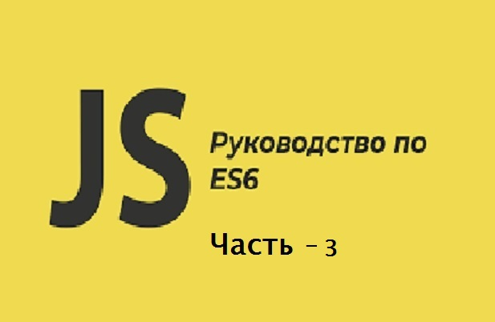

# Знаете ли вы ES6 - часть 3.

[Знаете ли вы ES6 - часть 1.](https://github.com/YaroslavW/trening-js/blob/master/Texts/ES6/es6-part1.md)

[Знаете ли вы ES6 - часть 2.](https://github.com/YaroslavW/trening-js/blob/master/Texts/ES6/es6-part2.md)

[Знаете ли вы ES6 - часть 3.](https://github.com/YaroslavW/trening-js/blob/master/Texts/ES6/es6-part3.md)

<hr>



Содержание:

- IIFE Immediately Invoked Function Expression - Немедленно вызванное функциональное выражение.
- Closures - Замыкания.
- Synchronous vs Asynchronous - Синхронность -Асинхронность.
- Promises - Обещания (промисы)
- Async vs Await - Ожидания (асинк \ авейт)

## IIFE (Immediately Invoked Function Expression)

IIFE относится к выражению немедленного вызова функции. IIFE - это функция JavaScript, которая запускается сразу после ее определения. [MDN Web Docs](https://developer.mozilla.org/en-US/docs/Glossary/IIFE "mozilla.org")

IIFE отличается от традиционной функции, которую мы можем назвать несколько раз, но IIFE нет. IIFE используется только один раз. Поэтому мы не будем использовать его снова. Это означает, что переменные в функции не доступны, поэтому они неизменны.

Одним из преимуществ IIFE является создание локальной области, и это очень важно, если у меня много js-файлов, которые могут иметь одинаковые имена переменных. Таким образом, IIFE избегает переопределения и защищает область своих переменных.

Есть два способа вызвать функцию:

1. Во-первых, наш традиционный способ определить и вызвать функцию

```javascript
function printName() {
  let myName = "Yaroslav";
  console.log(myName);
  // Yaroslav
}

//Invoke
printName();
```

2. Во-вторых, используя IIFE. Мы заключаем нашу функцию в скобки, затем добавляем пару скобок в конце функции

(Наша функция) (Invoke - вызвать)

(Наша функция) ()

```javascript
(function printName() {
  let myName = "Yaroslav";
  console.log(myName);
  // Yaroslav
})();
```

На самом деле нам не нужно давать имя функции, потому что она вызывается только один раз. Так что IIFE обычно будет анонимной функцией

```javascript
(function() {
  let myName = "Yaroslav";
  console.log(myName);
  // Yaroslav
})();
```

## Closures - Замыкания

Замыкания - это когда функция запоминает свою лексическую область видимости, даже если функция выполняется вне лексической области видимости. Таким образом, замыкание - это когда функция использует переменную, определенную в другой функции или другой области видимости. Так что сделайте ссылку на эту переменную, чтобы обновить ее значение.

В примере у нас есть функция `printName`, которая имеет переменную. Затем у нас есть вложенная функция печати, которая использует эту переменную в этой области. Тогда у нас есть функция замыкания, которая вызывает функцию печати. Наконец, мы можем вызвать эту функцию в другой области.

Другими словами, мы можем выполнить функцию печати, которая использует переменную имени. Эта переменная не объявлена здесь в области действия функции замыкания. Но эта переменная находится в области действия функции `printName`.

По умолчанию логика неверна. Но на самом деле это замыкание и это работает. Поэтому, если мы изменим или обновим значение нашего имени переменной, замыкание обновит его.

```javascript
function printName() {
  var name = "Yaroslav";
  //name="Yaroslav Kolesnikov";
  function print() {
    console.log(name);
  }

  closure(print);
}

function closure(func) {
  func();
}

printName();
```

Другой пример, мы можем получить и обновить переменную x во внутренней функции

```javascript
function outer() {
  let x = 4;
  function inner() {
    let y = x;
    y = 16;
    console.log(x);
    console.log(x * 2);
    console.log(y);
  }

  closure(inner);
}

function closure(inn) {
  inn();
}

outer();
```

Это еще один способ создать предыдущую функцию замыкания. Здесь мы заменили внутреннюю функцию на анонимную функцию, которая возвращает несколько значений в массиве. Затем мы выполнили внешнюю функцию.

```javascript
function outer() {
  let x = 4;
  return function() {
    let y = x;
    y = 16;
    return [x, x * 2, y];
  };
}

//IIFE
console.log(outer()());

//let res = outer()
//console.log(res());
```

давайте посмотрим на другой пример, это простой счетчик, использующий замыкание. В любом случае, я рекомендую вам использовать `++n` и увидеть разницу.

```javascript
function counter(n) {
  return function() {
    return n++;
  };
}

let res = counter(1);
console.log(res());
console.log(res());
console.log(res());
console.log(res());
console.log(res());
```

давайте углубимся в более сложное. Что вы ожидаете выхода этого кода? СЧИТАТЬ!!

```javascript
for (var i = 0; i < 10; i++) {
  setTimeout(function() {
    console.log(i);
  }, 100);
}
```

После размышления. Выходное значение является последним значением нашего счетчика `i`. Которое равно - `10`.

Потому что `i` переменная, определенная в глобальной области видимости. Так что это произошло из-за замыкания. Опять же, Clousure - замыкание использует последнее значение нашей переменной, которое определено в другой области видимости.

Я думаю, вы хотите знать, как решить эту проблему? Хорошо, есть более одного решения. Один из них - использовать `let` для создания счетчика `i`, потому что `let` - это локальная область, а не глобальная.

```javascript
for (let i = 0; i < 10; i++) {
  setTimeout(function() {
    console.log(i);
  }, 100);
}
```

Мы можем решить это, используя функцию IIFE, которая выполняется немедленно. Так что замыкание фиксирует setTimeout.

```javascript
function closure(index) {
  setTimeout(function() {
    console.log(index);
  }, 100);
}

for (var i = 0; i < 10; i++) {
  closure(i);
}
```

Более подробно это, я разбирал в первой части - [Знаете ли вы ES6 - часть 1.](https://github.com/YaroslavW/trening-js/blob/master/Texts/ES6/es6-part1.md)

## Synchronous vs Asynchronous

### Синхронное программирование.

Синхронное программирование означает, что ваш код работает построчно, функция за функцией. Таким образом, вы не можете запустить две функции одновременно.

### Асинхронное программирование.

Асинхронная функция в трех простых словах означает «она может подождать». Другими словами, означает, что ваша функция может быть запущена во время работы другой функции. Таким образом, вы можете запустить две функции одновременно, не останавливая программу.

Асинхронные функции приходят из веб-API, которые имеют много асинхронных функций. JS имеет множество встроенных асинхронных функций, таких как `setTimeOut`, `setInterval`, `Promises`, обработчики событий - Event handlers и т. д.

Есть еще один тип функции, называемый **Callback function** - функцией обратного вызова, который выполняется после завершения асинхронной функции.

В следующем примере мы определяем функцию `getStudent`, которая принимает функцию обратного вызова в качестве параметра. Затем мы вызываем функцию обратного вызова, которая возвращает имя и возраст учащегося с задержкой ответа на 2 секунды.

Наконец, мы вызываем `getStudent` и передаем функцию обратного вызова в качестве параметра, и эта функция вызывается, когда проходит 2-секундная задержка.

Из выходных данных последний оператор `console.log` выполняется первым, потому что выполнение функции обратного вызова все еще задерживается на 2 секунды, поэтому выходной сигнал задерживается.

```javascript
const getStudent = callback => {
  setTimeout(() => {
    callback({ name: "Yarosav", age: 48 });
  }, 2000);
};

getStudent(student => {
  console.log("This is executed second");
  console.log(student.name, student.age);
});

console.log("This is executed first");
```

## Promises - Обещания.

### Что такое обещание?

`Promise` - это встроенная асинхронная функция в JS, которая упрощает обработку асинхронного кода.

Обещание - это асинхронное действие, которое может завершиться в какой-то момент и привести к значению. Так что с `Promise`, мы пытаемся выполнить некоторые операции. Если операции удалось выполнить, мы обещаем нечто, что называется `resolve` - решением. Если произойдет сбой, мы сделаем `reject` - отказ. Так что обещание имеет дело с асинхронными операциями.

### Как создать обещание?

Мы используем конструктор с именем `Promise`, который принимает функцию исполнителя. Эта функция пытается выполнить операции и `resolve` - разрешить или `reject` - отклонить обещание.

Это первое обещание

```javascript
let p = new Promise((resolve, reject) => {
  setTimeout(() => {
    console.log("promise done");
    resolve("done");
  }, 2000);
});
```

### Как узнать, работает ли обещание или нет?

Узнать результат обещания - `resolve` - решить или `reject`- отклонить. Мы используем `then` и - `catch` - ловим, чтобы получить результат.

- `then` функция принимает успешно выполняется, когда происходит `resolve` для обещания. Это означает, что действие успешно завершено. Также `then` возвращает еще одно обещание.

* `Catch` принимает функцию, которая успешно выполняется, когда происходит `reject` - отклонение для обещания или сбой.

```javascript
let p = new Promise((resolve, reject) => {
  setTimeout(() => {
    console.log("promise done");
    resolve("done");
    //reject('Is not done. Error')
  }, 2000);
});

p.then(() => console.log("promise resolved")).catch(() =>
  console.log("promise rejected")
);
```

### Значение для `resolve` - разрешения или `reject`- отклонения.

Теперь, каким бы ни был результат, решите или отклоните. Что делать, если нам нужно значение этого `resolve` или `reject`.

Вот наше значение для `resolve` - «сделано», а наша значение для `reject` - «Не сделано». `Error`. Таким образом, чтобы получить его, наша функция `then` или `catch` принимает параметр.

```javascript
let p = new Promise((resolve, reject) => {
  setTimeout(() => {
    console.log("promise done");
    resolve("Done");
    reject("Is not done. Error");
  }, 2000);
});

p.then(res => console.log("promise resolved", res)).catch(err =>
  console.log("promise rejected", err)
);
```

### Вложенное обещание.

Что делать, если наше обещание закончилось, и мы хотим выполнить другое обещание. Это называется вложенным обещанием.

```javascript
let p = new Promise((resolve, reject) => {
  setTimeout(() => {
    console.log("promise done");
    resolve("Done");
  }, 2000);
});

//Nested promise
p.then(res => {
  p.then(res2 => console.log(res2));
});
```

### Цепочка обещаний.

Я хочу сказать вам, что вложенное обещание не является хорошей практикой. Так что цепочки обещаний...

Вот наша функция, возвращающая наше обещание `p`, и результатом функции `then` является наше обещание `p`. Наконец, мы можем использовать `then`, чтобы сделать цепочку обещаний.

```javascript
let p = new Promise((resolve, reject) => {
  setTimeout(() => {
    console.log("promise done");
    resolve("Done");
  }, 2000);
});

//Chaining promise
p.then(res => {
  return p;
}).then(res2 => console.log(res2));
//p.then((res) => p).then(res2 => console.log(res2))
```

Вот окончательный код

```javascript
let p = new Promise((resolve, reject) => {
  setTimeout(() => {
    console.log("promise done");
    resolve("Done");
  }, 2000);
});

//Nested promise
p.then(res => {
  p.then(res2 => console.log(res2));
});

//Chaining promise
p.then(res => {
  return p;
}).then(res2 => console.log(res2));

//Chaining promise
p.then(res => p).then(res2 => console.log(res2));

//Chaining promise .. Best practice and more readable
p.then(res => p).then(res2 => console.log(res2));
```

Когда у меня есть цепочка обещаний и Если какое-либо обещание будет `rejected` отклонено, оно выполнит первый `catch` и проигнорирует остальные.

```javascript
let p = new Promise((resolve, reject) => {
  setTimeout(() => {
    console.log("promise done");
    reject("Is not done. Error");
  }, 2000);
});

//Chaining promise
p.then(res => p)
  .then(res2 => console.log(res2))
  .catch(err1 => console.log("promise rejected 1", err1))
  .catch(err2 => console.log("promise rejected 2", err2));
```

Наконец, вы помните наш пример обратного вызова. Я собираюсь сделать это с обещанием с тем же выходом. Попробуй это понять LOL :)

```javascript
let p = new Promise((resolve, reject) => {
  setTimeout(() => {
    let error = false;
    if (!error) {
      console.log("This is executed second, Done");
      resolve({ name: "Yaroslav", age: 48 });
    } else {
      console.log("This is executed second, Error");
      reject();
    }
  }, 2000);
});

const getStudent = () => {
  return p;
};

getStudent().then(student => {
  console.log(student.name, student.age);
});

console.log("This is executed first");
```

## Async vs Await.

### Async

`Async` - ключевое слово, `Await` - оператор. Они были добавлены в ES8.

`Async` vs `Await` заставляет нас справляться с обещанием лучше, чем использование цепочки обещаний, поэтому наше обещание стало проще.

`Async` используется с функцией, которая означает, что это асинхронная функция, но она возвращает обещание.

- Return == Resolve

- Throw == Reject

В этом примере Наше обещание разрешить или вернуть `myName` «I am Yaroslav»

```javascript
async function myName() {
  return "I am Yaroslav";
}

myName().then(msg => console.log(msg));
```

В этом примере Наше обещание будет отклонено `- reject` или `throw` и веренет `isName` «Is not Yaroslav»

```javascript
async function isName() {
  throw "Is not Yaroslav";
}
isName().catch(msg => console.log(msg));
```

### Await

`await` означает, что вам нужно дождаться выполнения этой строки. `await` действителен только в асинхронной функции.

В следующем примере у нас есть обещание `p` и асинхронная функция `myName`. Мы заметим, что `This is executed first` - «Это выполнено первым» - это первая строка, но затем мы должны дождаться окончания нашего обещания `p`. Наконец, после выполнения обещания, остальное выполняется, поэтому последняя строка - «I am Yaroslav».

```javascript
let p = new Promise((resolve, reject) => {
  setTimeout(() => {
    console.log("promise done");
    resolve("Done");
  }, 2000);
});

async function myName() {
  console.log("This is executed first");
  await p;
  //p
  console.log("I am Yaroslav");
}

myName();
```

Вы знаете, обещание принять решение или отклонить - resolve or reject. Теперь, результат ожидания является результатом - resolve or reject (решения или отклонения).

Если обещание `resolve`

```javascript
let p = new Promise((resolve, reject) => {
  setTimeout(() => {
    console.log("promise done");
    resolve("Done");
  }, 2000);
});

async function myName() {
  let result = await p;
  console.log("The result of await is : " + result);
}
myName();
```
Если обещание  `reject` - отвергнуть, оно автоматически сгенерирует ошибку. Поэтому мы должны избегать цепочки обещаний и использовать этот способ.

```javascript
let p = new Promise((resolve, reject) => {
  setTimeout(() => {
    console.log('promise done')
    //resolve('Done')
    reject('error 404')
  }, 2000)
})

async function myName(){
   let result = await p
   return result
}

myName()
  .then( res => console.log('The result of await is : ' + res))
  .catch( err => console.log('Error: ' + err))
  ```
  Наконец, вы помните наш пример обратного вызова. Мы сделали это двумя способами, используя обратный вызов и обещание.

Теперь я собираюсь сделать это с помощью `async/await` с тем же выводом. Попробуй еще раз понять это сам по себе :) LOL :(

```javascript
let p = new Promise((resolve, reject) => {
    setTimeout(() => {
        resolve({ name: 'Yaroslav', age: 48 })
        //reject('error 404')
    }, 2000)

})

const getStudent = () => {
    return p
}

async function fetchStudent () {
    let student = await getStudent()
    return student
}
fetchStudent()
  .then(student => console.log(student.name + " " + student.age))
  .catch((err) => console.log("Error: " + err))

console.log("This is executed first")
```
* Также мы можем использовать `try` и `catch` для обработки ошибок.

```javascript
let p = new Promise((resolve, reject) => {
    setTimeout(() => {
        let error = false;
        if(error)
        {
            console.log("This is executed second, Done")
            resolve({ name: 'Yaroslav', age: 48 })
        }
        else
        {
            console.log("This is executed second, Error")
            reject()
        }
    }, 2000)
})

const getStudent = () => {
    return p
}

async function fetchStudent () {
    try { 
        const student = await getStudent()
        return student
    } catch (error) {
        console.log("Error")
    }
}

fetchStudent()
  .then(student => console.log(student.name + " " + student.age))
  .catch(() => console.log("error 404"))

console.log("This is executed first")
```
<hr>

[Знаете ли вы ES6 - часть 1.](https://github.com/YaroslavW/trening-js/blob/master/Texts/ES6/es6-part1.md)

[Знаете ли вы ES6 - часть 2.](https://github.com/YaroslavW/trening-js/blob/master/Texts/ES6/es6-part2.md)

[Знаете ли вы ES6 - часть 3.](https://github.com/YaroslavW/trening-js/blob/master/Texts/ES6/es6-part3.md)