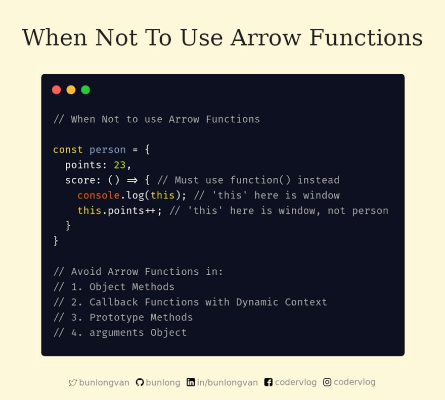

# Когда не стоит использовать стрелочные функции.

Вот несколько случаев, когда вам, вероятно, следует избегать использования функций стрелок - `arrow functions`.



## 1. Object Methods

```javascript
const person = {
  points: 23,
  score: () => {
    console.log(this); // 'this' here is window
    this.points++; // 'this' here is window, not person
  }
};
person.score();
console.log(person.points); // 23
```

Когда вы делаете `console.log(person.points)`, результат должен быть `24`, но он все равно `23`.

Почему? потому что это всегда ограничено родителем, который в данном случае является окном - `window` (`this` не привязан ни к чему другому).

Вместо этого вы должны использовать обычную функцию.

```js
const person = {
  points: 23,
  score: function() {
    this.points++; // 'this' here is person
  }
};
person.score();
console.log(person.points); // 24
```

---

## 2. Callback Functions with Dynamic Context

Функция обратного вызова с динамическим контентом.

```js
const button = document.getElementById("myButton");
button.addEventListener("click", () => {
  console.log(this); // 'this' here is window
  this.innerHTML = "Clicked Button"; // 'this' here is window, not button
});
```

Когда вы нажимаете кнопку `myButton`, она на самом деле не работает.

Почему? потому что `this` не связан с кнопкой, но вместо этого связан с ее родительской областью, которая в этом случае является `window`.

Вместо этого вы должны использовать обычную функцию:

```javascript
const button = document.getElementById("myButton");
button.addEventListener("click", function() {
  console.log(this); // button
  this.innerHTML = "Clicked Button"; // 'this' here is button
});
```

---

## 3. Prototype Methods

```js
class Person {
  constructor(points) {
    this.points = points;
  }
}
Person.prototype.info = () => {
  console.log(this); // 'this' here is window
  return `Points: ${this.points}`; // // 'this' here is window, not Person
};
const me = new Person(24);
console.log(me.info());
```

Когда вы делаете `console.log(me.info ())`, он на самом деле не работает.

Почему? Почему? потому что `this` не связан с `Person`, но вместо этого связан с его родительской областью, которая в этом случае является `window`.

Вместо этого вы должны использовать обычную функцию:

```js
class Person {
  constructor(points) {
    this.points = points;
  }
}
Person.prototype.info = function() {
  console.log(this); // Person
  return `Points: ${this.points}`; // // 'this' here is Person
};
const me = new Person(24);
console.log(me.info());
```

---

## 4. arguments Object
