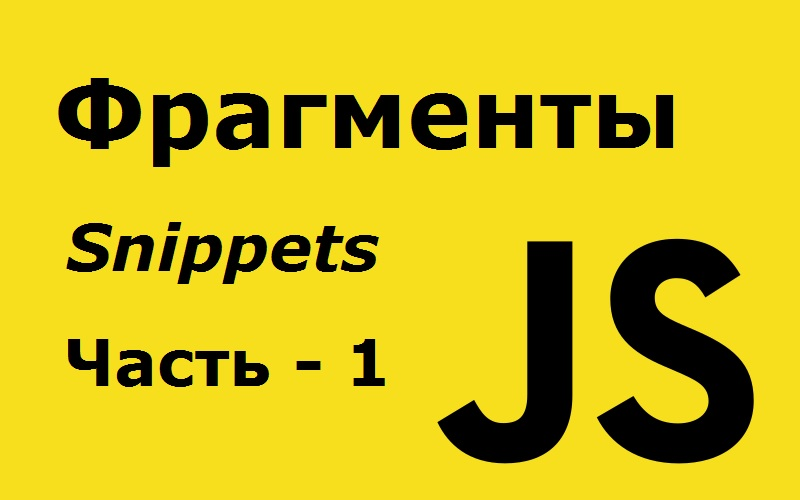

# 127 полезных фрагментов JavaScript, которые вы можете выучить за 30 секунд или меньше - часть 1 из 6.



JavaScript - один из самых популярных языков, который вы можете изучать. Как говорят многие: «Если вы собираетесь изучать только один язык программирования, переходите на JavaScript».

Куинси Ларсон, основатель FreeCodeCamp, спросил в недавнем интервью, какой язык разработчики должны изучить в первую очередь. Он ответил: «JavaScript.»:

> _«Программное обеспечение поглощает мир, а JavaScript - программное обеспечение. С каждым годом JavaScript становится все более доминирующим, и никто не знает, что в итоге может его заменить._

> _Если у вас нет очень веских причин для изучения нового языка (например, ваша работа требует от вас поддержки кодовой базы не-JavaScript), мой скромный совет - сосредоточиться на том, чтобы стать лучше в JavaScript »._

Если это звучит убедительно для вас, вот список из 127 полезных фрагментов, которые вы можете изучить и использовать немедленно.

---

## 1 All

Этот фрагмент возвращает `true`, если функция предиката возвращает `true` для всех элементов в коллекции, и `false` в противном случае. Вы можете опустить второй аргумент `fn`, если хотите использовать `Boolean` в качестве значения по умолчанию.

```javascript
const all = (arr, fn = Boolean) => arr.every(fn);

all([4, 2, 3], x => x > 1); // true
all([1, 2, 3]); // true
```

## 2. allEqual

Этот фрагмент проверяет, все ли элементы массива равны.

```javascript
const allEqual = arr => arr.every(val => val === arr[0]);

allEqual([1, 2, 3, 4, 5, 6]); // false
allEqual([1, 1, 1, 1]); // true
```

## 3. approximatelyEqual

Этот фрагмент проверяет, являются ли два числа приблизительно равными друг другу, с небольшой разницей.

```javascript
const approximatelyEqual = (v1, v2, epsilon = 0.001) =>
  Math.abs(v1 - v2) < epsilon;

approximatelyEqual(Math.PI / 2.0, 1.5708); // true
```

## 4. arrayToCSV

Этот фрагмент преобразует элементы в строки со значениями, разделенными запятыми.

```javascript
const arrayToCSV = (arr, delimiter = ",") =>
  arr.map(v => v.map(x => `"${x}"`).join(delimiter)).join("\n");

arrayToCSV([["a", "b"], ["c", "d"]]); // '"a","b"\n"c","d"'
arrayToCSV([["a", "b"], ["c", "d"]], ";"); // '"a";"b"\n"c";"d"'
```

## 5. arrayToHtmlList

Этот фрагмент преобразует элементы массива в теги `<li>` и добавляет их в список с указанным идентификатором.

```javascript
const arrayToHtmlList = (arr, listID) =>
  (el => (
    (el = document.querySelector("#" + listID)),
    (el.innerHTML += arr.map(item => `<li>${item}</li>`).join(""))
  ))();

arrayToHtmlList(["item 1", "item 2"], "myListID");
```

## 6. attempt

Этот фрагмент выполняет функцию, возвращающую либо результат, либо объект обнаруженной ошибки.

```javascript
const attempt = (fn, ...args) => {
  try {
    return fn(...args);
  } catch (e) {
    return e instanceof Error ? e : new Error(e);
  }
};
var elements = attempt(function(selector) {
  return document.querySelectorAll(selector);
}, ">_>");
if (elements instanceof Error) elements = []; // elements = []
```

## 7. average

Этот фрагмент возвращает среднее из двух или более числовых значений.

```javascript
const average = (...nums) =>
  nums.reduce((acc, val) => acc + val, 0) / nums.length;
average(...[1, 2, 3]); // 2
average(1, 2, 3); // 2
```

## 8. averageBy

Этот фрагмент возвращает среднее значение массива после первоначального сопоставления каждого элемента со значением, используя данную функцию.

```javascript
const averageBy = (arr, fn) =>
  arr
    .map(typeof fn === "function" ? fn : val => val[fn])
    .reduce((acc, val) => acc + val, 0) / arr.length;

averageBy([{ n: 4 }, { n: 2 }, { n: 8 }, { n: 6 }], o => o.n); // 5
averageBy([{ n: 4 }, { n: 2 }, { n: 8 }, { n: 6 }], "n"); // 5
```

## 9. bifurcate

Этот фрагмент разбивает значения на две группы, а затем помещает истинный элемент фильтра в первую группу, а во вторую - в противном случае.

Вы можете использовать `Array.prototype.reduce()` и `Array.prototype.push()` для добавления элементов в группы на основе фильтра.

```javascript
const bifurcate = (arr, filter) =>
  arr.reduce((acc, val, i) => (acc[filter[i] ? 0 : 1].push(val), acc), [
    [],
    []
  ]);
bifurcate(["beep", "boop", "foo", "bar"], [true, true, false, true]);
// [ ['beep', 'boop', 'bar'], ['foo'] ]
```
