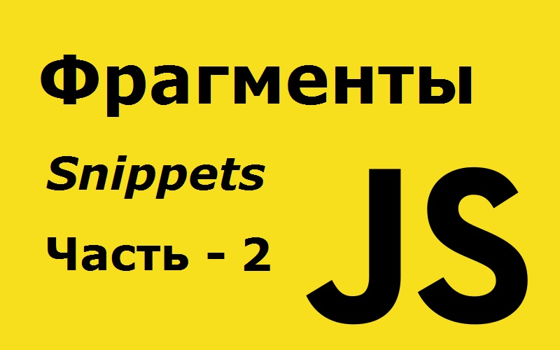

# 127 полезных фрагментов JavaScript, которые вы можете выучить за 30 секунд или меньше - часть 1 из 6.



Это вторая часть этой серии с полезными фрагментами JavaScript, которые вы можете выучить за 30 секунд или меньше. Вы можете найти [первую часть здесь](https://github.com/YaroslavW/trening-js/blob/master/Texts/JS-Snippets/1-part.md).

---

## 22. deepFlatten

Этот фрагмент рекурсивно сглаживает массив.

```javascript
const deepFlatten = arr =>
  [].concat(...arr.map(v => (Array.isArray(v) ? deepFlatten(v) : v)));

deepFlatten([1, [2], [[3], 4], 5]); // [1,2,3,4,5]
```

---

## 23. default

Этот фрагмент назначает значения по умолчанию для всех свойств объекта, которые не определены -`undefined`.

```javascript
const defaults = (obj, ...defs) =>
  Object.assign({}, obj, ...defs.reverse(), obj);

defaults({ a: 1 }, { b: 2 }, { b: 6 }, { a: 3 }); // { a: 1, b: 2 }
```

---

## 24. defer

Этот фрагмент задерживает выполнение функции до тех пор, пока текущий стек вызовов не будет очищен.

```javascript
const defer = (fn, ...args) => setTimeout(fn, 1, ...args);

defer(console.log, "a"), console.log("b"); // logs 'b' then 'a'
```

---

## 25. degreesToRads

Этот фрагмент кода может быть использован для преобразования значения из градусов в радианы.

```javascript
const degreesToRads = deg => (deg * Math.PI) / 180.0;

degreesToRads(90.0); // ~1.5708
```

---

## 26. difference

Этот фрагмент находит разницу между двумя массивами.

```javascript
const difference = (a, b) => {
  const s = new Set(b);
  return a.filter(x => !s.has(x));
};

difference([1, 2, 3], [1, 2, 4]); // [3]
```

---

## 27. differenceBy

Этот метод возвращает разницу между двумя массивами после применения данной функции к каждому элементу обоих списков.

```javascript
const differenceBy = (a, b, fn) => {
  const s = new Set(b.map(fn));
  return a.filter(x => !s.has(fn(x)));
};

differenceBy([2.1, 1.2], [2.3, 3.4], Math.floor); // [1.2]
differenceBy([{ x: 2 }, { x: 1 }], [{ x: 1 }], v => v.x); // [ { x: 2 } ]
```

---

## 28. differenceWith

Этот фрагмент удаляет значения, для которых функция сравнения возвращает `false`.

```javascript
const differenceWith = (arr, val, comp) =>
  arr.filter(a => val.findIndex(b => comp(a, b)) === -1);

differenceWith(
  [1, 1.2, 1.5, 3, 0],
  [1.9, 3, 0],
  (a, b) => Math.round(a) === Math.round(b)
);
// [1, 1.2]
```

---

## 29. digitize

Этот фрагмент получает число в качестве входных данных и возвращает массив его цифр.

```javascript
const digitize = n => [...`${n}`].map(i => parseInt(i));

digitize(431); // [4, 3, 1]
```

---

## 30. distance

Этот фрагмент возвращает расстояние между двумя точками путем вычисления евклидова расстояния.

```javascript
const distance = (x0, y0, x1, y1) => Math.hypot(x1 - x0, y1 - y0);

distance(1, 1, 2, 3); // 2.23606797749979
```

---

## 31. Drop Elements

Этот фрагмент возвращает новый массив с n элементами, удаленными слева.

```javascript
const drop = (arr, n = 1) => arr.slice(n);

drop([1, 2, 3]); // [2,3]
drop([1, 2, 3], 2); // [3]
drop([1, 2, 3], 42); // []
```

---

## 32. dropRight

Этот фрагмент возвращает новый массив с n элементами, удаленными справа.

```javascript
const dropRight = (arr, n = 1) => arr.slice(0, -n);

dropRight([1, 2, 3]); // [1,2]
dropRight([1, 2, 3], 2); // [1]
dropRight([1, 2, 3], 42); // []
```

---

## 33. dropRightWhile

Этот фрагмент удаляет элементы из правой части массива, пока переданная функция не вернет `true`.

```javascript
const dropRightWhile = (arr, func) => {
  while (arr.length > 0 && !func(arr[arr.length - 1])) arr = arr.slice(0, -1);
  return arr;
};

dropRightWhile([1, 2, 3, 4], n => n < 3); // [1, 2]
```

---

## 34. dropWhile

Этот фрагмент удаляет элементы из массива, пока переданная функция не вернет `true`.

```javascript
const dropWhile = (arr, func) => {
  while (arr.length > 0 && !func(arr[0])) arr = arr.slice(1);
  return arr;
};

dropWhile([1, 2, 3, 4], n => n >= 3); // [3,4]
```

---

## 35. elementContains

Этот фрагмент проверяет, содержит ли родительский элемент дочерний элемент.

```javascript
const elementContains = (parent, child) =>
  parent !== child && parent.contains(child);

elementContains(
  document.querySelector("head"),
  document.querySelector("title")
); // true
elementContains(document.querySelector("body"), document.querySelector("body")); // false
```

---

## 36. Filter Duplicate Elements

Этот фрагмент удаляет повторяющиеся значения в массиве.

```javascript
const filterNonUnique = arr => [ …new Set(arr)];
filterNonUnique([1, 2, 2, 3, 4, 4, 5]); // [1, 2, 3, 4, 5]
```

---

## 37. findKey

Этот фрагмент возвращает первый ключ, который удовлетворяет заданной функции.

```javascript
const findKey = (obj, fn) =>
  Object.keys(obj).find(key => fn(obj[key], key, obj));

findKey(
  {
    barney: { age: 36, active: true },
    fred: { age: 40, active: false },
    pebbles: { age: 1, active: true }
  },
  o => o["active"]
); // 'barney'
```

---

## 38. findLast

Этот фрагмент возвращает последний элемент, для которого данная функция возвращает истинное значение.

```javascript
const findLast = (arr, fn) => arr.filter(fn).pop();

findLast([1, 2, 3, 4], n => n % 2 === 1); // 3
```

---

## 39. flatten

Этот фрагмент выравнивает массив до заданной глубины с помощью рекурсии.

```javascript
const flatten = (arr, depth = 1) =>
  arr.reduce(
    (a, v) =>
      a.concat(depth > 1 && Array.isArray(v) ? flatten(v, depth - 1) : v),
    []
  );

flatten([1, [2], 3, 4]); // [1, 2, 3, 4]
flatten([1, [2, [3, [4, 5], 6], 7], 8], 2); // [1, 2, 3, [4, 5], 6, 7, 8]
```

---

## 40. forEachRight

Этот фрагмент выполняет функцию для каждого элемента массива, начиная с последнего элемента массива.

```javascript
const forEachRight = (arr, callback) =>
  arr
    .slice(0)
    .reverse()
    .forEach(callback);

forEachRight([1, 2, 3, 4], val => console.log(val)); // '4', '3', '2', '1'
```

---

## 41. forOwn

Этот фрагмент выполняет итерации для каждого свойства объекта и выполняет обратный вызов для каждого из них соответственно.

```javascript
const forOwn = (obj, fn) =>
  Object.keys(obj).forEach(key => fn(obj[key], key, obj));
forOwn({ foo: "bar", a: 1 }, v => console.log(v)); // 'bar', 1
```

---

## 42. functionName

Этот фрагмент выводит имя функции в консоль.

```javascript
const functionName = fn => (console.debug(fn.name), fn);

functionName(Math.max); // max (logged in debug channel of console)
```

---

Это вторая часть этих коротких фрагментов. Осталось еще четыре части.
