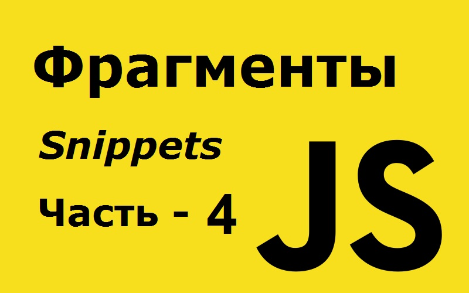

# 127 полезных фрагментов JavaScript, которые вы можете выучить за 30 секунд или меньше - часть 4 из 6.

Это третья часть этих коротких фрагментов. Осталось еще три части. Здесь [часть первая](https://github.com/YaroslavW/trening-js/blob/master/Texts/JS-Snippets/1-part.md), [часть вторая](https://github.com/YaroslavW/trening-js/blob/master/Texts/JS-Snippets/2-part.md) и [часть третья](https://github.com/YaroslavW/trening-js/blob/master/Texts/JS-Snippets/3-part.md).

---

## 64. isBrowser
