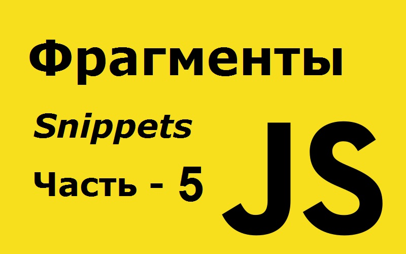

# 127 полезных фрагментов JavaScript, которые вы можете выучить за 30 секунд или меньше - часть 4 из 6.



Это четвертая часть этих коротких фрагментов. Осталось еще две части. Здесь [часть первая](https://github.com/YaroslavW/trening-js/blob/master/Texts/JS-Snippets/1-part.md), [часть вторая](https://github.com/YaroslavW/trening-js/blob/master/Texts/JS-Snippets/2-part.md), [часть третья](https://github.com/YaroslavW/trening-js/blob/master/Texts/JS-Snippets/3-part.md) и [ четвертая часть](https://github.com/YaroslavW/trening-js/blob/master/Texts/JS-Snippets/4-part.md).

---

## 85. minN

Этот фрагмент возвращает `n` самых маленьких элементов из списка. Если `n` больше или равно длине списка, он вернет исходный список (отсортированный в порядке возрастания).

```javascript
const minN = (arr, n = 1) => [...arr].sort((a, b) => a - b).slice(0, n);

minN([1, 2, 3]); // [1]
minN([1, 2, 3], 2); // [1,2]
```

---

## 86. negate

Этот фрагмент можно использовать для применения оператора not (`!`) К функции предиката с ее аргументами.

```javascript
const negate = func => (...args) => !func(...args);

[1, 2, 3, 4, 5, 6].filter(negate(n => n % 2 === 0)); // [ 1, 3, 5 ]
```

---

## 87. nodeListToArray

Этот фрагмент может быть использован для преобразования nodeList в массив.

```javascript
const nodeListToArray = nodeList => [...nodeList];

nodeListToArray(document.childNodes); // [ <!DOCTYPE html>, html ]
```

---

## 88. pad

Этот фрагмент можно использовать для дополнения строки с обеих сторон указанным символом, если она короче указанной длины.

```javascript
const pad = (str, length, char = " ") =>
  str.padStart((str.length + length) / 2, char).padEnd(length, char);

pad("cat", 8); // '  cat   '
pad(String(42), 6, "0"); // '004200'
pad("foobar", 3); // 'foobar'
```

---

## 89. radsToDegrees

Этот фрагмент можно использовать для преобразования угла в радианах в градусы.

```javascript
const radsToDegrees = rad => (rad * 180.0) / Math.PI;

radsToDegrees(Math.PI / 2); // 90
```

---

## 90. Random Hexadecimal Color Code

Этот фрагмент можно использовать для генерации случайного шестнадцатеричного цветового кода.

```javascript
const randomHexColorCode = () => {
  let n = (Math.random() * 0xfffff * 1000000).toString(16);
  return "#" + n.slice(0, 6);
};

randomHexColorCode(); // "#e34155"
```

---

## 91. randomIntArrayInRange
