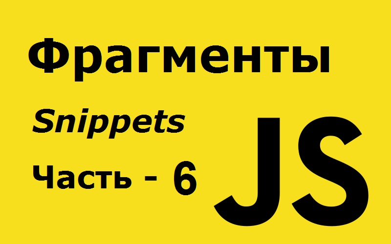

# 127 полезных фрагментов JavaScript, которые вы можете выучить за 30 секунд или меньше - часть 4 из 6.



Это четвертая часть этих коротких фрагментов. Осталось еще две части. Здесь [часть первая](https://github.com/YaroslavW/trening-js/blob/master/Texts/JS-Snippets/1-part.md), [часть вторая](https://github.com/YaroslavW/trening-js/blob/master/Texts/JS-Snippets/2-part.md), [часть третья](https://github.com/YaroslavW/trening-js/blob/master/Texts/JS-Snippets/3-part.md), [ четвертая часть](https://github.com/YaroslavW/trening-js/blob/master/Texts/JS-Snippets/4-part.md) и [пятая часть](https://github.com/YaroslavW/trening-js/blob/master/Texts/JS-Snippets/5-part.md).

---

## 107. similarity

Этот фрагмент можно использовать для возврата массива элементов, которые появляются в двух массивах.

```javascript
const similarity = (arr, values) => arr.filter(v => values.includes(v));

similarity([1, 2, 3], [1, 2, 4]); // [1, 2]
```

---

## 108. sleep

Этот фрагмент можно использовать, чтобы задержать выполнение асинхронной функции, поместив ее в режим сна.

```javascript
const sleep = ms => new Promise(resolve => setTimeout(resolve, ms));

async function sleepyWork() {
  console.log("I'm going to sleep for 1 second.");
  await sleep(1000);
  console.log("I woke up after 1 second.");
}
```

---

## 109. smoothScroll

Этот фрагмент можно использовать для плавной прокрутки элемента, по которому он вызывается, в видимую область окна браузера.

```javascript
const smoothScroll = element =>
  document.querySelector(element).scrollIntoView({
    behavior: "smooth"
  });

smoothScroll("#fooBar"); // плавно прокручивается к элементу с идентификатором fooBar
smoothScroll(".fooBar"); // плавно прокручивается до первого элемента с классом fooBar
```

---

## 110. sortCharactersInString

Этот фрагмент можно использовать для сортировки символов в строке по алфавиту.

```javascript
const sortCharactersInString = str =>
  [...str].sort((a, b) => a.localeCompare(b)).join("");

sortCharactersInString("cabbage"); // 'aabbceg'
```

---

## 111. splitLines

Этот фрагмент можно использовать для разбиения многострочной строки на массив строк.

```javascript
const splitLines = str => str.split(/\r?\n/);

splitLines("This\nis a\nmultiline\nstring.\n"); // ['This', 'is a', 'multiline', 'string.' , '']
```

---

## 112. stripHTMLTags

Этот фрагмент можно использовать для удаления тегов HTML / XML из строки.

```javascript
const stripHTMLTags = str => str.replace(/<[^>]*>/g, "");

stripHTMLTags("<p><em>lorem</em> <strong>ipsum</strong></p>"); // 'lorem ipsum'
```

---

## 113. sum

Этот фрагмент можно использовать для нахождения суммы двух или более чисел или массивов.

```javascript
const sum = (...arr) => [...arr].reduce((acc, val) => acc + val, 0);

sum(1, 2, 3, 4); // 10
sum(...[1, 2, 3, 4]); // 10
```

---

## 114. tail

Этот фрагмент можно использовать для получения массива со всеми элементами массива, кроме первого. Если массив имеет только один элемент, то вместо него будет возвращен массив с этим элементом.

```javascript
const tail = arr => (arr.length > 1 ? arr.slice(1) : arr);

tail([1, 2, 3]); // [2,3]
tail([1]); // [1]
```

---

## 115. take

Этот фрагмент можно использовать для получения массива, в котором `n` элементов удалены с самого начала.

```javascript
const take = (arr, n = 1) => arr.slice(0, n);

take([1, 2, 3], 5); // [1, 2, 3]
take([1, 2, 3], 0); // []
```

---

## 116. takeRight

Этот фрагмент можно использовать для получения массива с `n` элементами, удаленными с конца.

```javascript
const takeRight = (arr, n = 1) => arr.slice(arr.length - n, arr.length);

takeRight([1, 2, 3], 2); // [ 2, 3 ]
takeRight([1, 2, 3]); // [3]
```

---

## 117. timeTaken

Этот фрагмент можно использовать, чтобы узнать время, необходимое для выполнения функции.

```javascript
const timeTaken = callback => {
  console.time("timeTaken");
  const r = callback();
  console.timeEnd("timeTaken");
  return r;
};

timeTaken(() => Math.pow(2, 10)); // 1024, (logged): timeTaken: 0.02099609375ms
```

---

## 118. times

Этот фрагмент может быть использован для итерации обратного вызова `n` раз.

```javascript
const times = (n, fn, context = undefined) => {
  let i = 0;
  while (fn.call(context, i) !== false && ++i < n) {}
};

var output = "";
times(5, i => (output += i));
console.log(output); // 01234
```

---

## 119. toCurrency

Этот фрагмент можно использовать для форматирования числа как валюты.

```javascript
const toCurrency = (n, curr, LanguageFormat = undefined) =>
  Intl.NumberFormat(LanguageFormat, {
    style: "currency",
    currency: curr
  }).format(n);

toCurrency(123456.789, "EUR");
// €123,456.79  | currency: Euro | currencyLangFormat: Local
toCurrency(123456.789, "USD", "en-us");
// $123,456.79  | currency: US Dollar | currencyLangFormat: English (United States)
toCurrency(123456.789, "USD", "fa");
// ۱۲۳٬۴۵۶٫۷۹ ؜$ | currency: US Dollar | currencyLangFormat: Farsi
toCurrency(322342436423.2435, "JPY");
// ¥322,342,436,423 | currency: Japanese Yen | currencyLangFormat: Local
toCurrency(322342436423.2435, "JPY", "fi");
// 322 342 436 423 ¥ | currency: Japanese Yen | currencyLangFormat: Finnish
```

---

## 120. toDecimalMark

Этот фрагмент использует функцию `toLocaleString()` для преобразования математического выражения с плавающей запятой в десятичную форму с использованием числа для создания строки, разделенной запятыми.

```javascript
const toDecimalMark = num => num.toLocaleString("en-US");

toDecimalMark(12305030388.9087); // "12,305,030,388.909"
```

---

## 121. toggleClass

Этот фрагмент можно использовать для переключения класса для элемента.

```javascript
const toggleClass = (el, className) => el.classList.toggle(className);

toggleClass(document.querySelector("p.special"), "special");
// У абзаца больше не будет «специального» класса
```

---

## 122. tomorrow

Этот фрагмент можно использовать для получения строкового представления о завтрашней дате.

```javascript
const tomorrow = () => {
  let t = new Date();
  t.setDate(t.getDate() + 1);
  return t.toISOString().split("T")[0];
};

tomorrow(); // 2019-09-08 (if current date is 2018-09-08)
```

---

## 123. unfold

Этот фрагмент можно использовать для построения массива с использованием функции итератора и начального начального значения.

```javascript
const unfold = (fn, seed) => {
  let result = [],
    val = [null, seed];
  while ((val = fn(val[1]))) result.push(val[0]);
  return result;
};

var f = n => (n > 50 ? false : [-n, n + 10]);
unfold(f, 10); // [-10, -20, -30, -40, -50]
```

---

## 124. union

Этот фрагмент можно использовать для нахождения объединения - `union` двух массивов, в результате чего получается массив, содержащий элементы, которые поступают из обоих массивов, но не повторяются.

```javascript
const union = (a, b) => Array.from(new Set([...a, ...b]));

union([1, 2, 3], [4, 3, 2]); // [1,2,3,4]
```

---

## 125. uniqueElements

Этот фрагмент использует ES6 `Set` и оператор `...rest`, чтобы получить каждый элемент только один раз.

```javascript
const uniqueElements = arr => [...new Set(arr)];

uniqueElements([1, 2, 2, 3, 4, 4, 5]);
// [1, 2, 3, 4, 5]
```

---

## 126. validateNumber

Этот фрагмент можно использовать для проверки, является ли значение числом.

```javascript
const validateNumber = n =>
  !isNaN(parseFloat(n)) && isFinite(n) && Number(n) == n;

validateNumber("10"); // true
```

---

## 127. words

Этот фрагмент преобразует строку в массив слов.

```javascript
const words = (str, pattern = /[^a-zA-Z-]+/) =>
  str.split(pattern).filter(Boolean);

words("I love javaScript!!"); // ["I", "love", "javaScript"]
words("python, javaScript & coffee"); // ["python", "javaScript", "coffee"]
```

---
