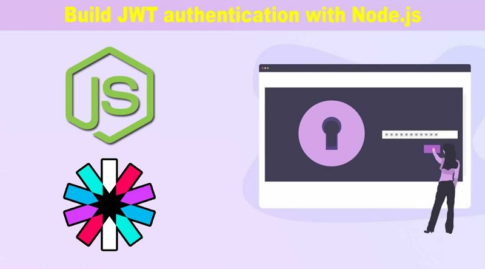
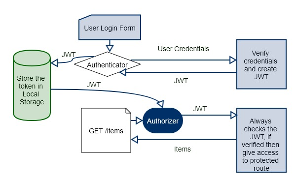
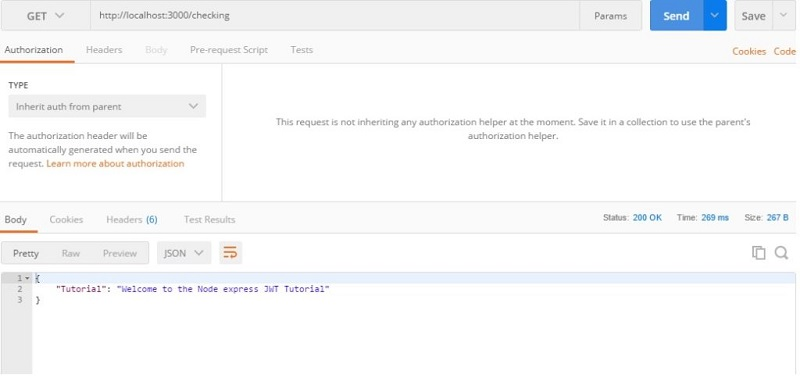

# Сборка аутентификации JWT с Node.js



**В этом обзоре мы рассмотрим токены Node.js и JSON. Мы покажем вам, как создать маршрут для создания токена и использовать этот токен для отправки запроса на защищенный маршрут.**

Задумывались ли вы, как работает аутентификация? Что стоит за всей сложностью и абстракциями. На самом деле ничего особенного. Это способ шифрования значения, в свою очередь создание уникального токена, который пользователи используют в качестве идентификатора. Этот токен подтверждает вашу личность. Он может проверять, кто вы, и авторизовать различные ресурсы, к которым у вас есть доступ. Если вы случайно не знаете ни одного из этих ключевых слов, наберитесь терпения, я объясню все ниже.

Node js JWT Руководство по аутентификации - это тема, которую мы обсудим сегодня. Полная форма JWT - JSON Web Token. Если мы хотим создать безопасное веб-приложение, мы должны реализовать аутентификацию. После этого нам нужно построить Авторизацию. Существует два типа аутентификации, которые вы можете использовать в любой разработке веб-приложений.

1. - Session-based Authentication (Сеансовая аутентификация)

2. - Token-based Authentication (Аутентификация на основе токенов)

## Почему мы используем аутентификацию на основе токенов.

Аутентификация на основе сеансов - это хорошо, тогда почему мы хотим использовать аутентификацию на основе токенов? Причины следующие.

1. Основная причина в том, что это Аутентификация без сохранения состояния. Этот токен хранится в локальном хранилище на стороне клиента, но также может храниться в хранилище сеансов (session storage) или в файле cookie.

2. В большинстве случаев это одностраничные приложения, веб-API и Интернет вещей (IoT).

3. Если наше приложение масштабируемо и самостоятельное (отделено от других), то это лучший выбор для использования этого фактического стандарта.

4. Это может быть мобильное приложение или веб-приложение, подготовленное независимо от того, какие технологии вы используете для создания веб-приложения или мобильного приложения.

## Как работает JWT?

> Посмотрие мой перевод статьи ["Простое введение в основы JWT."](https://github.com/YaroslavW/trening-js/blob/master/Texts/JWT-Basics/simple_intro_to_jwt_basics.md)



JSON Web Token - это токен; нам нужно поставить заголовок в каждом запросе для проверки клиента. Архитектура аутентификации JWT чертовски проста.

1. Первая попытка пользователя войти под своими учетными данными.

2. После проверки учетных данных сервер отправляет веб-токен JSON клиенту.

3. Затем клиент сохраняет этот токен в локальном хранилище или любом другом механизме хранения.

4. Опять же, если клиент хочет запросить защищенный маршрут или ресурс, он отправляет JWT в заголовке запроса.

5. Сервер проверяет, что JWT и, если он верен, возвращает ответ 200 с информацией, необходимой клиенту.

6. Если JWT недействителен, то он дает несанкционированный доступ или любое другое ограниченное сообщение.

## Node.js Аутентификация c JWT.

В этом уроке мы не используем интерфейсную среду. Мы будем использовать POSTMAN для запроса сервера. Мы проверим аутентификацию с помощью токена. Итак, давайте начнем.

### Шаг 1: Установите зависимости Node.js

Создайте папку проекта и перейдите в эту папку. Введите следующую команду.

```javascript
npm init
```

Теперь установите следующие зависимости.

```javascript
npm install express jsonwebtoken mongoose body-parser --save
```

Он установит `express`-фреймворк, пакет `jsonwebtoken` для аутентификации пользователя, модель схемы `mongoose` и промежуточное программное обеспечение `body-parser`.

Также нам нужно установить сервер разработки `nodemon`, чтобы предотвратить остановку и перезапуск процесса сервера. Итак, давайте сделаем это в первую очередь.

```javascript
npm install nodemon --save-dev
```

Остальные зависимости мы установим по мере роста нашего проекта.

### Шаг 2: Настройте Node Server.

В файле `package.json` измените этот объект на следующий.

```javascript
"scripts": {
    "start": "nodemon server"
},
```

Поэтому в терминале, когда мы набираем команду `npm start`, мы запускаем файл `server.js`. В корневой папке - `src`, создайте один файл с именем `server.js`. Настройте Node server.

```javascript
// server.js

const express = require("express");
const app = express();
const bodyParser = require("body-parser");

const PORT = 3000;

app.listen(PORT, function() {
  console.log("Server is running on Port", PORT);
});
```

Теперь перейдите к терминалу и пропишите следующую инструкцию.

```javascript
npm start
```

Запустится сервер, вы можете увидеть это на консоли. Так что он готов принять любой запрос, будь то веб или API.

### Шаг 3: Отправить запрос на Node-Server через Postman.

Сначала мы определяем один маршрут (route) и отправляем JSON ответ клиенту.

```javascript
// server.js

app.get("/checking", function(req, res) {
  res.json({
    Tutorial: "Welcome to the Node express JWT Tutorial"
  });
});
```

Откройте Postman и отправьте `get` - запрос на `http://localhost:3000/checking`



### Шаг 4: Настройте базу данных MongoDB.

Напишите следующий код, чтобы подключить приложение Node.js к базе данных MongoDB.

```javascript
// server.js

const mongoose = require("mongoose");

mongoose.connect("mongodb://localhost/jwtauth");
```

Кроме того, напишите в приложение промежуточное ПО для `body-parser`.

```javascript
// server.js

app.use(bodyParser.urlencoded({ extended: false }));
app.use(bodyParser.json());
```

### Шаг 5: Создайте модель пользователя.
