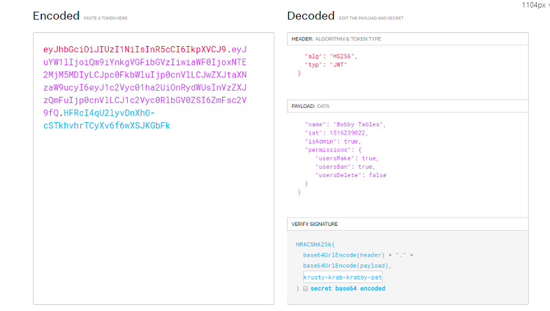

# Простое введение в основы JWT.



Если вы откладываете изучение JWT (веб-токенов JSON), потому что они звучат страшно или сложно, у меня есть хорошие новости! Это действительно не так! В этом коротком упрощенном руководстве я расскажу об основах JWT, о том, что делает их уникальными, а также об их сильных и слабых сторонах по сравнению с другими формами аутентификации.

## Введение - _Что_ такое JWT?

Веб-токены JSON, или JWT, представляют собой подход без проверки состояния (подробнее об этом позже) к аутентификации и управлению сессиями, где информация об аутентификации или сеансе (пользователь-администратор? Права доступа и т. Д.) Может храниться **внутри самого токена**. , а не на сервере.

По сути, вы можете думать о JWT как о **контейнере**, полном **истин**, которые отправил сервер (они называются утверждениями - _claims_ в терминах JWT), и метаданных о том, как хранятся эти «истины» (алгоритм и типы).

В наиболее практических терминах, JWT можно представить в виде одной строки, которую вы увидите позже.

## Stateless? Что это обозначает?

JWT _не всегда_ являются частью системы без сохранения состояния (Stateless), но то, как они составлены, предоставляет им такую настройку.

В типичной системе, отличной от JWT, если вы хотите обрабатывать аутентификацию и разные разрешения для разных людей, вы обычно используете комбинацию сеансов и хранилище на стороне сервера - это будет ваше состояние - `state`. Когда пользователь входит в систему, вы создаете для него новый сеанс - **session** с уникальным идентификатором, и для проверки разрешений вы просматриваете его идентификатор пользователя в таблице разрешений и / или таблице ролей. На каждой загружаемой странице может потребоваться несколько поисков в БД (базе данных), чтобы проверить допустимый сеанс, затем получить роли, затем получить разрешения и т. Д.

В отличие от этого, в JWT вся информация как о действительности пользователя (вошедшего в систему), так и его роли и / или разрешениях содержится **_непосредственно в самой строке JWT_**. Сервер, получив входящий JWT, просто должен убедиться, что он действителен, но не обязательно выполнять поиск в базе данных. Этому может делать хранилище без сохранения состояние - stateless.

Однако у этого подхода есть и недостатки, которые будут обсуждаться позже.

## Разбираем это дальше - части JWT.

JWT могут показаться ошеломляющими, поэтому давайте разберем их по частям:

### Как они на самом деле выглядят?

Во-первых, вам может быть интересно, как на самом деле выглядит JWT. Ну, и последняя строка, отправляемая с сервера клиенту для хранения в `localStorage`, `sessionStorage` или `cookie`, может выглядеть следующим образом (реальный пример):

```javascript
eyJhbGciOiJIUzI1NiIsInR5cCI6IkpXVCJ9
  .eyJuYW1lIjoiQm9iYnkgVGFibGVzIiwiaWF0IjoxNTE2MjM5MDIyLCJpc0FkbWluIjp0cnVlLCJwZXJtaXNzaW9ucyI6eyJ1c2Vyc01ha2UiOnRydWUsInVzZXJzQmFuIjp0cnVlLCJ1c2Vyc0RlbGV0ZSI6ZmFsc2V9fQ
  .HFRcI4qU2lyvDnXhO - cSTkhvhrTCyXv6f6wXSJKGbFk;
```

Просветление, а? Ну, это гораздо менее страшно, когда вы узнаете, что это все, всего лишь:

```javascript
base64Url(header) + "." + base64Url(payload) + "." + base64Url(signature);
```

Давайте разберемся с этим дальше ...

### Кусочки.

Как вы видели выше, JWT состоит из трех основных компонентов, каждый из которых закодирован в base64 (с веб-безопасным вариантом ([ web-safe variant](https://en.wikipedia.org/wiki/Base64#RFC_4648)), чтобы избежать символов, которые могут испортить URL) перед объединением. Каждый из этих компонентов, кроме сигнатуры, также является объектом JSON до кодирования, но об этом ниже:

#### Header:

Заголовок - это часть, которая содержит метаданные о самом JWT. Как минимум, он будет содержать тип алгоритма, используемого для шифрования подписи, но иногда также содержит дополнительные метаданные, такие как тип самого токена (JWT).

Пример:

```javascript
{
  "alg": "HS256",
  "typ": "JWT"
}
```

В этом примере заголовок гласит: «Эй, я токен типа JWT с алгоритмом шифрования `HS256!`»

#### Payload:

Полезная нагрузка (Payload) действительно самая важная часть с точки зрения функциональности, а не безопасности. Полезная нагрузка (Payload) содержит утверждения (или истины, как я их ранее называл), которые, по словам сервера, принадлежат тому, кто владеет JWT и может отправить его обратно на сервер.

Когда пользователь отправляет JWT обратно на сервер через заголовок, URL, cookie и т. Д., Сервер декодирует полезную нагрузку (Payload) и может использовать ее тысячами способов; например, позволяя пользователю выполнить действие «удалить», поскольку одно из утверждений состоит в том, что он является администратором.

Пример Payload:

```javascript
{
  "name": "Bobby Tables",
  "iat": 1516239022,
  "isAdmin": true,
  "permissions": {
     "usersMake": true,
     "usersBan": true,
     "usersDelete": false
  }
}
```

Не существует обязательных пар ключей, которые должны быть в вашей полезной нагрузке, хотя некоторые стандартизированы и распространены. Например, `iat` является зарегистрированной заявкой для `issued at`, и, если она указана, должно быть числом, представляющим метку времени, когда был выпущен JWT. Вам следует избегать конфликтов с зарезервированными / зарегистрированными именами претензий (заявлений). Вы можете прочитать больше о них в оригинальной спецификации [здесь](https://tools.ietf.org/html/rfc7519#section-4).

> Напоминание: Вы должны стараться, чтобы и ключи, и значения были короткими, поскольку JWT спроектирован так, чтобы быть маленьким.

#### Signature:

Подпись JWT является наиболее важной частью, когда речь заходит о безопасности. По сути, это значение заголовка + полезная нагрузка, передаваемое через функцию хэширования одностороннего шифрования, которая использует секрет, который знают ТОЛЬКО сервер или другие доверенные объекты.

Если вы base64 декодируете значение, оно выглядит как бред, потому что это безопасный хеш:

```javascript
.T\#..Ú\¯.uá;ç.NHo.´ÂÉ{ú.¬.H..lY
```

Псевдокод для генерации этого хэша на сервере выглядит примерно так:

```javascript
HMACSHA256(base64Url(header) + "." + base64Url(payload), SECRET_KEY);
```

Подпись - это способ для сервера с помощью своего секретного ключа \*\* проверить, что JWT, который отправляет пользователь, является действительным и созданным им самим или доверенным создателем.

(PS: секретный ключ, который я использовал во всех моих примерах, был `krusty-krab-krabby-patty-secret-formula`).

> \*\* = Если вы используете асимметричное шифрование, вы можете использовать открытый ключ для проверки. См. Подраздел «Алгоритмы подписи» в разделе «Насколько это безопасно?».

## Крткое повторение разбивки JWT

Итак, чтобы подвести итог и показать, как эти части снова сочетаются друг с другом, мы берем:

```javascript
const header = {
  alg: "HS256",
  typ: "JWT"
};

const payload = {
  name: "Bobby Tables",
  iat: 1516239022,
  isAdmin: true,
  permissions: {
    usersMake: true,
    usersBan: true,
    usersDelete: false
  }
};
```

... сделать подпись с помощью алгоритма одностороннего шифрования ...

```javascript
// Pseudo code
const signature = hashHS256(header, payload).withSecret(SECRET_KEY);
```

... и, наконец, объединяем части в одну строку после base64'ing каждой части:

```javascript
// Pseudo code
const jwtString =
  base64Url(header) + "." + base64Url(payload) + "." + base64Url(signature);
```

## Насколько это безопасно?

Механизм безопасности JWT покоится в его компоненте подписи (обрисованном в общих чертах выше). Чтобы разбить его дальше, когда пользователь отправляет JWT обратно на сервер, сервер проверяет, чтобы убедиться, что утверждения заслуживают доверия, путем проверки подписи с помощью:

1.  Берет входящий заголовок и полезную нагрузку.
2.  Добавляет `SECRET_KEY`, который знают только сервер и валидатор (ы) \*\*
3.  Помещает заголовок, полезную нагрузку и секрет через хэш одностороннего шифрования.

    - Это создает сгенерированную сервером подпись.

4.  Убеждается, что вновь созданная подпись совпадает с подписью, отправленной пользователем в JWT.
5.  Если они совпадают, это доказывает, что JWT, отправленный пользователем, действительно был создан с тем же _секретом_, принадлежащим серверу!

Обратите внимание, что сила безопасности тесно связана с вашим секретным ключом - используйте подходящий длинный ключ (чтобы [избежать попыток перебора](https://auth0.com/blog/brute-forcing-hs256-is-possible-the-importance-of-using-strong-keys-to-sign-jwts/)), который никогда не будет разглашен.

> Примечание: в дополнение к проверке подписей серверы часто также проверяют JWT, проверяя их соответствие ожидаемой структуре и стандартам. Смотрите [это руководство auth0](https://auth0.com/docs/tokens/guides/jwt/validate-jwt) для деталей.

> \*\* = или открытый ключ, если используется асимметричное шифрование, см. ниже.

## Алгоритмы подписи.

В этих примерах я использую HMAC, который является симметричным алгоритмом (_symmetric algorithm_), что означает, что существует только один закрытый ключ и нет открытого ключа. Для того чтобы несколько сторон могли создавать или проверять JWT, они должны иметь секретный ключ.

При использовании асимметричного алгоритма (_asymmetric algorithm_) секретный ключ по-прежнему _используется_ для создания токенов, но открытый ключ также может использоваться для подтверждения действительности. Это означает, что другой сервер мог бы создать JWT, и ваш сервер мог бы все еще проверить его, сверяя с открытым ключом, без необходимости совместного использования личного / секретного ключа. Этот метод часто предпочтителен, потому что это способ для нескольких сторон иметь возможность проверки, в то время как только те, кто имеет закрытый ключ, могут создавать токены.

Я не буду вдаваться в подробности здесь, так как это, как предполагается, вступление, но вы можете прочитать больше [здесь](https://auth0.com/docs/tokens/concepts/signing-algorithms).

## Недостаток JWT: выход пользователей из системы / аннулирование токенов.

До сих пор JWT, похоже, обладают многочисленными преимуществами по сравнению с методами аутентификации с отслеживанием состояния, но то, что мы еще не обсуждали, - это выход пользователей из системы, удаление пользователей или иным образом аннулирование или отзыв токенов.

Правда в том, что именно здесь JTW терпят неудачу. Чтобы аннулировать JWT, вам _нужна_ какая-то база данных / система с сохранением состояния, потому что в конечном итоге вы поддерживаете либо черный список, либо белый список.

С черным списком, когда вы хотите аннулировать токен, вы добавляете его в таблицу черного списка, и всякий раз, когда пользователь пытается использовать JWT, вам всегда нужно проверять, что его нет в черном списке.

С белым списком это в основном то же самое, но добавьте каждый токен в белый список при его создании и удалите его из белого списка при аннулировании. И каждый входящий JWT будет принят, только если он находится в белом списке.

Если вам придется использовать любой из этих подходов, на мой взгляд, это является симптомом ваших потребностей, не согласующихся с тем, что могут предоставить JWT, и, возможно, пришло время переосмыслить архитектуру ваших веб-сайтов, чтобы увидеть, не существует ли лучшей альтернативы.

## Предотвращение state: автоматически истекающие сеансы.
