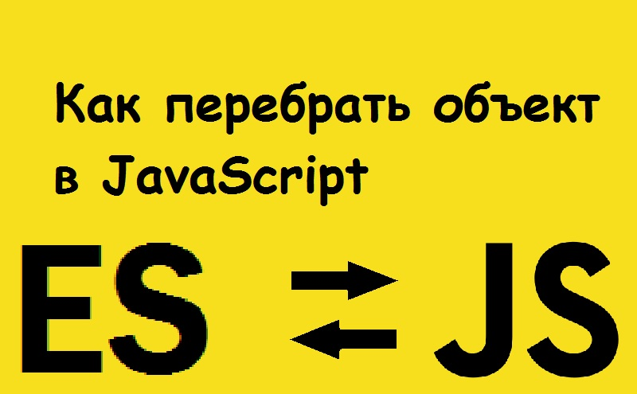

# Как перебрать объект в JavaScript (es6)



В этом уроке мы собираемся изучить различные способы циклического прохождения объекта в JavaScript.

## For in loop - Цикл `for in`

цикл `for in` помогает нам получить ключ объекта на каждой итерации, используя который мы можем получить доступ к значению объекта.

```javascript
const obj = {
  id: 1,
  name: "gowtham",
  active: true
};

for (let key in obj) {
  if (obj.hasOwnProperty(key)) {
    console.log(`${key} : ${obj[key]}`);
  }
}
// id : 1
// VM411:9 name : gowtham
// VM411:9 active : true
```

> Примечание: мы использовали метод `obj.hasOwnProperty (key)`, чтобы убедиться, что свойство принадлежит этому объекту, потому что цикл `for in` также выполняет итерации по цепочке прототипов объекта.

## Object.keys

Метод `Object.keys()` принимает объект в качестве аргумента и возвращает массив с заданными ключами объекта.

Объединяя метод `Object.keys` с методом `forEach`, мы можем получить доступ к парам ключ-значение объекта.

Пример:

```javascript
const obj = {
  id: 1,
  name: "gowtham",
  active: true
};

Object.keys(obj).forEach(key => {
  console.log(`${key} : ${obj[key]}`);
});
// id : 1
// name : gowtham
// active : true
```
