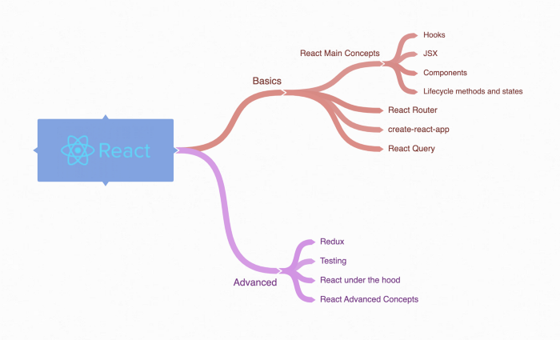
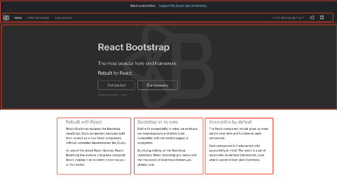

# **Дорожная карта 2021 года по обучению React**

React - одна из [самых популярных библиотек JavaScript](https://www.thinslices.com/blog/infographic-react.js-statistics) для создания динамических веб-приложений. У него огромная поддержка сообщества и активная команда разработчиков.

Хотя React сам по себе относительно прост, недостаточно просто изучить одну библиотеку, особенно если вы хотите создать сложное веб-приложение.

Я занимаюсь React с 2016 года, и по мере того, как мои задачи усложнялись, мне пришлось изучать другие «вспомогательные библиотеки» для реализации функций.

В этой статье я хочу изложить план действий, который вы можете использовать, чтобы научиться создавать реальные приложения с помощью React. Я перечислю важные концепции React и другие полезные библиотеки, которые вам следует знать.

## **Предпосылки**

Поскольку React - это библиотека JavaScript, вы должны хорошо знать основы JavaScript и синтаксис ES6.

Я бы порекомендовал вам начинать изучать React только после того, как вы научитесь кодировать простой веб-сайт, используя чистый HTML / CSS и ванильный JavaScript.

## **Основы**

В этом разделе я хочу поделиться вещами, которые вы должны изучить, чтобы создать простое, но функциональное приложение React. Рекомендуемые ресурсы для обучения (и те, которые я использовал) будут перечислены в конце раздела.

### create-react-app

[facebook/create-react-app](https://github.com/facebook/create-react-app)

Я верю в обучение посредством кодирования, и эта библиотека поможет вам быстро начать работу с приложением React.

Он настроит проект с некоторыми файлами по умолчанию и позволит вам сразу погрузиться в кодирование и посмотреть, как работает React.

Если вы любите приключения, вы также можете извлечь приложение и глубже понять, как код React транслируется для его запуска в браузере. Но если вы новичок, вам пока не стоит беспокоиться о том, как создать приложение React с нуля.

### JSX

Вы должны начать с самых основных концепций React, которые создают компоненты с использованием JSX. Вы редко увидите реальное приложение, написанное без него. Ознакомьтесь со следующими темами:

- [Rendering an element using JSX](https://reactjs.org/docs/rendering-elements.html)

- [Embedding JavaScript expressions](https://reactjs.org/docs/introducing-jsx.html#embedding-expressions-in-jsx)

- [Specifying element attributes](https://reactjs.org/docs/introducing-jsx.html#specifying-attributes-with-jsx)

- [Programmatically updating an element and seeing it change in the browser](https://reactjs.org/docs/rendering-elements.html#updating-the-rendered-element)

### Компоненты.

Это очень важная концепция, которую нужно понять. Приложение React состоит из множества автономных и повторно используемых _компонентов_.

Компоненты - это фрагменты кода, обладающие высокой специфичностью и обычно изолированные. Каждый компонент очень хорошо справляется с одной задачей, и данные передаются через свойства - `props` или контекст.

Например, у вас может быть один компонент заголовка, который отвечает только за отображение навигационных ссылок.

Эта концепция состоит из четырех частей:

- Изучение того, как обмениваться данными между компонентами

- Тренируйте свой ум думать о веб-странице с точки зрения компонентов

- Методы и состояния жизненного цикла

- Компоненты функции и класса

Вы должны понять концепцию `props`, как передать их дочерним компонентам и как проверить `props` с помощью `PropTypes`. Контекст - это еще один способ передачи данных между компонентами, но это более сложная концепция.

Затем вы захотите начать думать о веб-страницах с точки зрения компонентов. Возьмите любую веб-страницу, например [официальный сайт H&M](https://www2.hm.com/en_ca/index.html), и попробуйте разбить ее на компоненты. Это заставит вас сосредоточиться на мельчайших возможностях кода и попрактиковаться в разработке кода. Меня также несколько раз просили сделать это во время интервью.

Главная страница [React Bootstrap](https://react-bootstrap.github.io/), разбитая на компоненты

Каждый компонент имеет набор методов жизненного цикла, а динамические данные хранятся в состояниях. Когда данные, хранящиеся в состоянии, изменяются, компонент будет повторно отрисован, чтобы обновить это изменение. Это также фундаментальные концепции, которые необходимо понять.

Изучая эти концепции, вы, несомненно, столкнетесь с условным рендерингом и рендерингом нескольких компонентов из списка. На этом этапе вы должны быть в состоянии создать простое приложение React.

Последний момент, который необходимо понять, - это различия между функциональными и классовыми компонентами и их варианты использования. Это приведет прямо к крючкам - `Hooks`.
